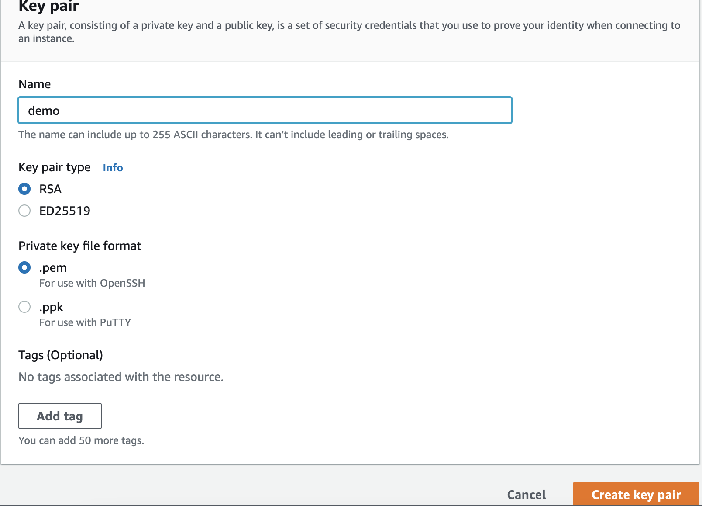

# HPC di AWS
Mencoba High Performance Computing di AWS

## Login ke AWS Console
Silahkan login ke AWS Console, jika anda menggunakan akun AWS di event workshop AWS, silahkan ikuti tata cara untuk masuk ke dalam console dan region yang digunakan

## Membuat EC2 Keypair
Keypair ini akan digunakan untuk membuat HPC cluster, masuk ke menu EC2 kemudian pilih **Network & Security**, pilih Key Pairs. Buat serta download keypair tersebut.



## Membuat Environment Cloud9
Kita akan menggunakan Cloud9 sebagai IDE dalam workshop ini. Pilih Menu **Cloud9** lalu pilih Create Environment, silahkan create Cloud9 environment dengan semua setting menggunakan nilai default. 

- Name: [wrf-workshop], lalu next
- Cost-saving pilih **After four hours**, lalu next
- Pilih Create Environment

setelah kita buat Cloud9 environment, jendela editor Cloud9 akan terbuka 

Upload Keypair yang sudah kita buat kedalam Cloud9. Pilih menu File -> Upload local Files. Pilih pem yang tadi anda sudah download pada pembuatan Keypair

## Instalasi ParallelCluster
Dalam workshop ini, semua perintah akan dijalankan di Cloud9.

1. Install ParallelCluster
```
python3 -m pip install "aws-parallelcluster" --user 
```

2. Konfigurasi ParallelCluster

Eksekusi perintah berikut untuk melakukan konfigurasi ParallelCluster dan menyimpan hasilnya pada file wrf.yaml

```
pcluster configure --config wrf.yaml   
```

Pilih nilai berikut untuk setting konfigurasi:

- AWS Region ID [us-east-2]:  **us-east-2**  ## Atau region lain yang dianjurkan dalam workshop 
- EC2 Key Pair Name [ee-default-keypair]: **pilih keypair yang sudah dibuat**
- Scheduler [slurm]: **slurm**
- Operating System [alinux2]: **alinux2**
- Head node instance type [t2.micro]: **c5.4xlarge**   
- Number of queues [1]: **1**
- Name of queue 1 [queue1]: **queue1**                           
- Number of compute resources for queue1 [1]: **1**
- Compute instance type for compute resource 1 in queue1 [t2.micro]: **c5n.18xlarge**
- Maximum instance count [10]: **2**
- Automate VPC creation? (y/n) [n]: **y**
- Availability Zone [us-east-2b]: **us-east-2a**
- Network Configuration [Head node in a public subnet and compute fleet in a private subnet]:  **Head node in a public subnet and compute fleet in a private subnet**      

3. Tunggu proses konfigurasi tersebut sampai selesai

4. Buat file baru, ganti nilai subnet dengan referensi dari file wrf.yaml, simpan file baru ini dengan nama wrf.yaml juga

```
Region: us-east-2
Image:
  Os: alinux2
HeadNode:
  InstanceType: c5.4xlarge
  LocalStorage:
    RootVolume:
      Size: 50
  Networking:
    SubnetId: subnet-XXXXXXXXXX     ## Public subnet yang sudah dibuat, lihat di file wrf.yaml
  DisableSimultaneousMultithreading: true
  Ssh:
    KeyName: wrf                  ## nama keypair yang sudah dibuat
Scheduling:
  Scheduler: slurm
  SlurmQueues:
  - Name: queue1
    ComputeResources:
    - Name: c5n18xlarge
      DisableSimultaneousMultithreading: true
      Efa:
        Enabled: true
        GdrSupport: false
      InstanceType: c5n.18xlarge
      MinCount: 0
      MaxCount: 2
    ComputeSettings:
      LocalStorage:
        EphemeralVolume:
          MountDir: /local/ephemeral
        RootVolume:
          Size: 50
    Networking:
      PlacementGroup:
        Enabled: true
      SubnetIds:
      - subnet-XXXXXXXXXX                 ## Private subnet yang sudah dibuat, lihat di file wrf.yaml
SharedStorage:
  - MountDir: /shared      
    Name: ebs
    StorageType: Ebs
    EbsSettings:
      VolumeType: gp3
      Iops: 3000
      Size: 1024
  - MountDir: /scratch 
    Name: fsx
    StorageType: FsxLustre
    FsxLustreSettings:
      StorageCapacity: 1200            
      DeploymentType: SCRATCH_2
```

Konfigurasi diatas akan membuat 2 buah mount point

1. /shared - Untuk menyimpan persistent data seperti aplikasi yang diinstal di head node (wfr, dll)
2. /scratch - Shared Volume menggunakan FSx for Lustre

## Membuat HPC Cluster

1. Dengan file yaml tersebut, kita akan membuat cluster yang bernama "wrf-cluster" 

```
pcluster create-cluster --cluster-name wrf-cluster --cluster-configuration ./wrf.yaml 
```

2. Tunggu sampai statusnya menjadu 'CREATE_COMPLETE' dengan eksekusi perintah berikut:
```
pcluster list-clusters
```

3. Login kedalam cluster dengan perintah berikut:
```
pcluster ssh --cluster-name wrf-cluster -i ./[nama keypair]
```

4. Validasi cluster dengan eksekusi perintah `sinfo` dan  `df -h` 


## Mencoba HPC Cluster

1. Buat program MPI Hello World dan jalankan di *Head Node* dengan copy dan paste kode berikut

```
mkdir -p ~/src ~/bin
cat > ~/src/hello.c << \EOF
#include <mpi.h>
#include <stdio.h>

int main(int argc, char** argv) {
    // Initialize the MPI environment
    MPI_Init(NULL, NULL);

    // Get the number of processes
    int world_size;
    MPI_Comm_size(MPI_COMM_WORLD, &world_size);

    // Get the rank of the process
    int world_rank;
    MPI_Comm_rank(MPI_COMM_WORLD, &world_rank);

    // Get the name of the processor
    char processor_name[MPI_MAX_PROCESSOR_NAME];
    int name_len;
    MPI_Get_processor_name(processor_name, &name_len);

    // Print off a hello world message
    printf("Hello world from processor %s, rank %d out of %d processors\n",
           processor_name, world_rank, world_size);

    // Finalize the MPI environment.
    MPI_Finalize();
}
EOF
mpicc -o ~/bin/hello ~/src/hello.c
mpirun -n 4 ${HOME}/bin/hello 
```

2. Jalankan kode MPI tersebut di *compute node* dengan perintah berikut:
```
srun --mpi=pmix -n 4 ${HOME}/bin/hello
```

## Instalasi WRF

Untuk mempermudah instalasi WRF, kita membutuhkan package manager yaitu spack. Copy Paste command dibawah ini untuk instalasi spack

```
export SPACK_ROOT=/shared/spack
mkdir -p $SPACK_ROOT
git clone -c feature.manyFiles=true https://github.com/spack/spack $SPACK_ROOT
echo "export SPACK_ROOT=/shared/spack" >> $HOME/.bashrc
echo "source \$SPACK_ROOT/share/spack/setup-env.sh" >> $HOME/.bashrc
source $HOME/.bashrc
```

Install patchelf menggunakan spack 

```
spack install patchelf
spack find 
spack load patchelf
which patchelf
```

Install Intel compiler dan Intel MPI

```
spack install intel-oneapi-compilers intel-oneapi-mpi
```

Proses diatas membutuhkan waktu sekitar 5-10 menit. Setelah terinstall pastikan path intel-oneapi-compilers, intel-oneapi-mpi ada di dalam spack compilers

```
spack compiler add `spack location -i intel-oneapi-compilers`/compiler/latest/linux/bin/intel64
spack compiler add `spack location -i intel-oneapi-compilers`/compiler/latest/linux/bin
spack compilers
```

ParallelCluster melakukan instalasi beberapa software yang ada di dalam cluster HPC, maka dari itu tambahkan software tersebut ke dalam spack dengan perintah dibawah ini

```
module load intelmpi openmpi libfabric-aws
spack external find
```

Kita akan melakukan instalasi WRF dengan menggunakan compute node. Kita gunakan slurm untuk melakukan submit job ke dalam slurm.

```
cat <<EOF > wrf-install.sbatch
#!/bin/bash
#SBATCH -N 1
#SBATCH --exclusive

echo "Installing WRF on \$SLURM_CPUS_ON_NODE cores."
module load intelmpi
spack install -j \$SLURM_CPUS_ON_NODE wrf%intel build_type=dm+sm ^intel-mpi
EOF
```

install wrf menggunakan slurm dengan perintah dibawah. Proses ini akan memakan waktu sekitar 45-60 menit.

```
sbatch wrf-install.sbatch
```

Untuk melakukan check hasil slurm, bisa lihat outputnya yang ada di direktori yang sama dengan script yang diekseskusi.

```
cat slurm-<jobID>.out
```

Ketika WRF sudah terinstall, maka kita load ke dalam spack dengan perintah dibawah

```
spack load wrf
```

## Mencoba proses data CONUS12KM menggunakan WRF

Download file data ke folder /scratch kemudian buat simlink

```
cd /scratch
curl -O https://www2.mmm.ucar.edu/wrf/OnLineTutorial/wrf_cloud/wrf_simulation_CONUS12km.tar.gz
tar -xzf wrf_simulation_CONUS12km.tar.gz
cd /scratch/conus_12km/
WRF_ROOT=$(spack location -i wrf%intel)/test/em_real/
ln -s $WRF_ROOT .
```

Submit script job menggunakan slurm. Buat script dengan nama slurm-wrf-conus12km.sh 

```
#!/bin/bash
#SBATCH --job-name=WRF
#SBATCH --output=conus-%j.out
#SBATCH --nodes=2
#SBATCH --ntasks-per-node=12
#SBATCH --exclusive

spack load wrf
set -x
wrf_exe=$(spack location -i wrf)/run/wrf.exe
ulimit -s unlimited
ulimit -a

export OMP_NUM_THREADS=6
export FI_PROVIDER=efa
export I_MPI_FABRICS=ofi
export I_MPI_OFI_LIBRARY_INTERNAL=0
export I_MPI_OFI_PROVIDER=efa
export I_MPI_PIN_DOMAIN=omp
export KMP_AFFINITY=compact
export I_MPI_DEBUG=4

set +x
module load intelmpi
set -x
time mpirun -np $SLURM_NTASKS --ppn $SLURM_NTASKS_PER_NODE $wrf_exe
```

Keterangan script diatas:
- menggunakan 2x c5n.18xlarge instances
- Masing-masing compute node mempunya 12 MPI processes (--ntasks-per-node=12)
- Masing-masing node menggunakan 6 OpenMP threads (export OMP_NUM_THREADS=6)

Submit job tersebut menggunakan slurm 

```
sbatch slurm-wrf-conus12km.sh
```
